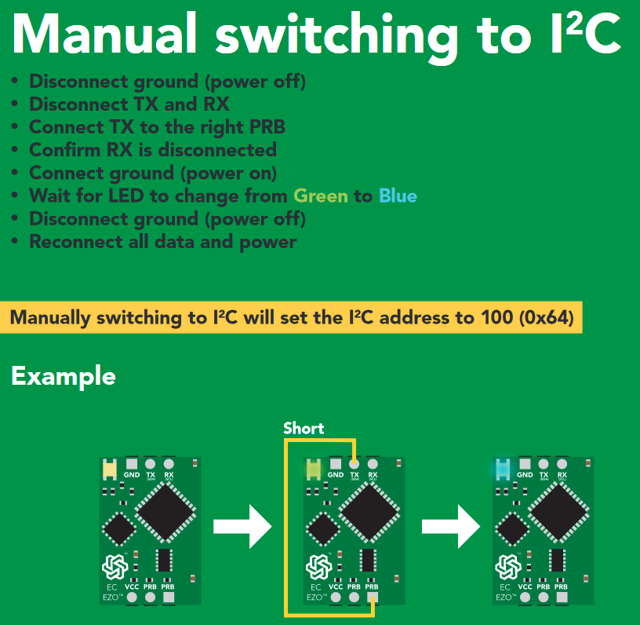

# Module 1 : Carte électronique PCB

## Compétences requises

* Soudure
* Électronique

> **Étapes de construction :**
>
> 1. Souder tous les pins de la face avant
> 2. Souder les composants de la face arrière
> 3. Souder  l'horloge, le booster, la carte SD, l'ESP32 et l'opto isolateur sur leurs pins

**Datalog :**

* ESP32 Firebeetle - Fournisseur
* Micro SD reader (compatible avec générique (Amazon, 3.3V), adafruit micro SD de chez gotronic) - Fournisseur
* Carte micro SD (8Go) - [Fournisseur](https://www.conrad.fr/fr/p/carte-microsdhc-transcend-ultimate-600x-8-gb-class-10-uhs-i-avec-adaptateur-sd-1396522.html)
* RTC : Compatible avec DS3231 générique Amazon et DS3231M DF Robot chez gotronic - [Fournisseur](https://www.gotronic.fr/art-module-rtc-i2c-dfr0641-32243.htm)
* Batterie 18650 - 3600mAh x2 - [Fournisseur](https://letmeknow.fr/fr/batteries/2120-batterie-lg-3600ma-18650-8438493108507.html)
* Led + R 47Ohm
* condensateurs ( 47pF, 1nF, 100nF)
* 2 Résistances 4700 Ohm de pullup pour I2C
* 1 résistance de 47 Ohm de pulldown pour l’isolateur
* 1 résistance 1000 Ohm
* 1 résistance 10 000 Ohm
* interrupteur à lames souples Reed Switch NO pour mode configuration - [Fournisseur](https://www.gotronic.fr/art-interrupteur-ils-1-rt-4082.htm)
* interrupteur à lames souples Reed Switch NF 1A pour interrupteur alimentation - [Fournisseur](https://www.gotronic.fr/art-interrupteur-ils-1-t-4080.htm)
* Connecteur NSK254-2 PCB Male x2
* Transistor 2N3904
* Pololu Step-up 5v U1V11F5 - [Fournisseur](https://www.gotronic.fr/art-booster-5-v-u1v11f5-21751.htm)
* Interrupteur on/off - [Fournisseur](https://fr.rs-online.com/web/p/interrupteurs-a-glissiere/7347296)

\
**Sonde :**

* Sonde conductivité Atlas Scientific EZO EC - [Fournisseur](https://www.robesol.nl/en/mini-conductivity-probe-k-10-87672470.html)
* Opto Isolateur Atlas (Isolated Carrier Board) -[ Fournisseur](https://www.robesol.nl/en/electrically-isolated-ezo-carrier-board-102660261.html)
* Circuit de conductivité - [Fournisseur](https://www.robesol.nl/en/ezo-conductivity-circuit-87672188.html)
* Sonde pression Blue Robotic BAR 30 - [Fournisseur](http://syera.fr/boutique/fr/pression-temperature/72-capteur-de-pression-haute-resolution-300m.html)
* Sonde température Blue Robotic Fast Temp - [Fournisseur](http://syera.fr/boutique/fr/pression-temperature/278-capteur-de-temperature.html)

\_\_\_\_\_\_\_\_\_\_\_\_\_\_\_\_\_\_\_\_\_\_\_\_\_\_\_\_\_\_\_\_\_\_\_\_\_\_\_\_\_\_\_\_\_\_\_\_\_\_\_\_\_\_\_\_\_\_\_\_\_\_\_\_\_\_\_\_\_\_\_\_\_\_\_\_\_\_\_\_\_\_\_\_\_\_\_\_\_\_\_\_

**Matériel face avant : (version sans le module UV)**

* ESP32 Firebeetle - Fournisseur
* Micro SD reader (compatible avec générique (amazon), adafruit micro SD de chez gotronic) -[ Fournisseur](https://www.amazon.fr/gp/product/B08YXSP666/ref=ppx_yo_dt_b_search_asin_title?ie=UTF8\&psc=1)
* Carte micro SD (8Go) - [Fournisseur](https://www.conrad.fr/fr/p/carte-microsdhc-transcend-ultimate-600x-8-gb-class-10-uhs-i-avec-adaptateur-sd-1396522.html)
* RTC : Compatible avec DS3231 générique Amazon et DS3231M DF Robot chez gotronic - [Fournisseur](https://www.gotronic.fr/art-module-rtc-i2c-dfr0641-32243.htm)
* Opto Isolateur Atlas (Isolated Carrier Board) -[ Fournisseur](https://www.robesol.nl/en/electrically-isolated-ezo-carrier-board-102660261.html)
* Circuit de conductivité EZO - [Fournisseur](https://www.robesol.nl/en/ezo-conductivity-circuit-87672188.html)
* Led + R 47 Ohm
* condensateurs ( 47pF, 1nF, 100nF)
* 2 Résistances 4,7kOhm de pullup pour I2C
* 1 résistance de 4.7KOhm de pulldown pour l’isolateur
* interrupteur à lames souples Reed Switch NF 1A pour interrupteur alimentation - [Fournisseur](https://www.gotronic.fr/art-interrupteur-ils-1-t-4080.htm)
* Embase pour CI, JST x2&#x20;
* Transistor 2N3904
* Pololu Step-up 5v U1V11F5 - [Fournisseur](https://www.gotronic.fr/art-booster-5-v-u1v11f5-21751.htm)
* Interrupteur on/off - [Fournisseur](https://fr.rs-online.com/web/p/interrupteurs-a-glissiere/7347296)

\
\
\

**1. Souder les composants de la face avant (sauf pour l'horloge, le booster, la carte SD, l'ESP32 et l'opto isolateur où vous ne souderez que les pins à la face dans un premier temps).**\

> NB : - Pour le booster, souder les grandes pins vers le haut
>
> * le coté plat de la LED doit être orienté vers le haut du PCB
> * il n'y a pas d'ordre précis pour les condensateurs

L'AtlasScientific (composant pour le capteur de salinité, couleur violet) doit d'abord se voir retirer les pins horizontaux avant d'en mettre de nouveaux verticaux.

\_\_\_\_\_\_\_\_\_\_\_\_\_\_\_\_\_\_\_\_\_\_\_\_\_\_\_\_\_\_\_\_\_\_\_\_\_\_\_\_\_\_\_\_\_\_\_\_\_\_\_\_\_\_\_\_\_\_\_\_\_\_\_\_\_\_\_\_\_\_\_\_\_\_\_\_\_\_\_\_\_\_\_\_\_\_\_\_\_\_\_\_

**Matériel face arrière :**

* Batterie 18650 - 3600mAh x2 - [Fournisseur](https://letmeknow.fr/fr/batteries/2120-batterie-lg-3600ma-18650-8438493108507.html)
* Support batterie 18650 x2 - [Fournisseur](https://letmeknow.fr/fr/coupleurs/1561-support-pour-batterie-18650-0616639922912.html)
* Interrupteur à lames souples Reed Switch NO pour mode configuration - [Fournisseur](https://www.gotronic.fr/art-interrupteur-ils-1-rt-4082.htm)

\
\

>
>
> **2. Souder les composants de la face arrière**\
>
>
> 

> Attention : à souder les supports batteries dans le bon sens (se référer au + et - dessinés sur les cartes PCB) et bien enlever les batterie lors de la soudure.

**3. Souder  l'horloge, le booster, la carte SD, l'ESP32 et l'opto isolateur sur leurs pins**\

* Lors de la soudure de l'interrupteur à lames souples Reed Switch, bien vérifier qu'il soit en position fermé à l'aide d'un multimètre (le courant doit passer) et couper l'autre pin.
* Dessouder les pins déjà présents sur l'optoisolateur Atlas.
* une fois le tout souder, ajouter le circuit de conductivité (carte verte, somme sur image ci-dessus)

> NB : mettre un point de colle sous l'opto-isolateur pour l'isoler de la soudure de la pile. Attention les interrupteurs à lame souple sont très fragiles

**Fichiers pour imprimer la carte :**

\

Gerber\_PCB\_Module\_CTD\_v2.3.zip

[https://wikifactory.com/preview/RmlsZTo4ODYyMjY=](https://wikifactory.com/preview/RmlsZTo4ODYyMjY=)

Test

#### 1. Hardware

**Vérifier les soudures**

* Vérifier à l'aide d'un multimètre que les soudures ne se touchent pas (notamment les transistors qui ont des pattes très rapprochées

**Vérifier le bon fonctionnement du module EZO (petit module vert sur lequel on vient connecter la sonde de conductimétrie)**

* Mettre la carte sous tension, et vérifier que la petit LED du module EZO (module auquel on relie la sonde) clignote. Si ce n'est pas le cas,
  * Vérifier qu'il y a bien une tension de 5V entre la borne VCC et la borne GND du module violet. Si ce n'est pas le cas, c'est probablement le voltage booster qui n'est pas bon (le petit module munie d'une bobine se trouvant sous la carte ESP). Une solution de secours consiste à soit alimenter directement le module violet avec la sortie 3.3V de la carte ESP, soit à faire un court circuit entre la première et la troisième patte du module voltage booster.

**VÉRIFIER QUE LE MODULE DE CONDUCTIMÉTRIE EZO EST BIEN CONFIGURÉ**

* Par défaut, le capteur communique en UART. Notre programme utilise le protocole I2c pour communiquer avec. Vous savez qu'il est en UART si le module vert clignote en vert puis bleu clair. Il clignote seulement en bleu foncé s'il est en I2c.
* Pour procéder en changement, munissez vous d'une alimentation stabilisée 5V (une Arduino ou une alimentation de laboratoire), et de 3 fils de connection.
* Détachez le module vert du module violet et branchez-le de la sorte :

\

* Le LED s'allume en bleu, c'est bon !
* Remettez le module vert sur le module violet (dans le bon sens !)

Lien de la doc : [https://files.atlas-scientific.com/EC\_EZO\_Datasheet.pdf](https://files.atlas-scientific.com/EC_EZO_Datasheet.pdf)\
