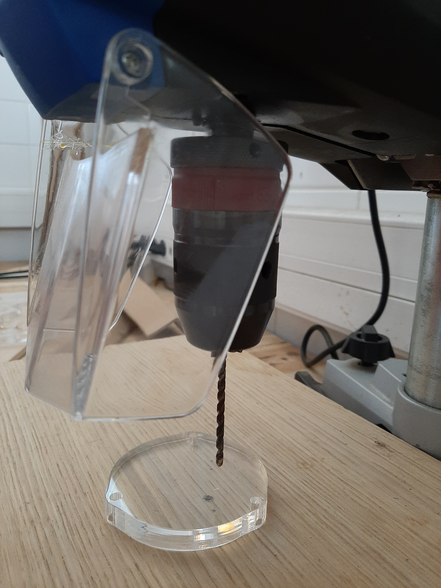
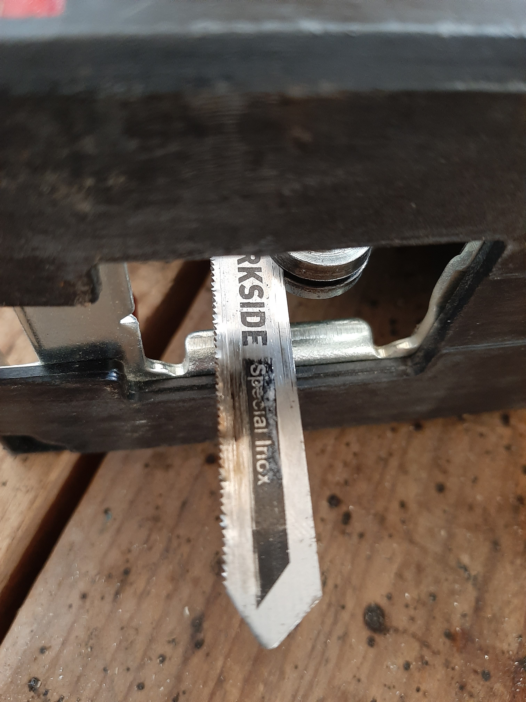

# Caisson OSO-CTD

#### Le capteur

#### Liste du matériel



\
**Boitiers :**

* tube Blue Robotic 2 pouces - [Fournisseur](http://syera.fr/boutique/fr/tubes-2-pouces/138-tube-verrouillable-pmma-2-pouces-300mm.html)
* Bouchon 2 pouces blue robotics - [Fournisseur](http://syera.fr/boutique/fr/64-brides-tapes-hublots-et-domes-2-pouces)

\
**Autres composants :**

* PCB (voir si dessous pour le plan)
* gros aimants
* 3 tige filetée 3mm, L 25cm
* Vis M3x10
* disque PMMA 10mm (pour les bouchons)
* Presse étoupe PG16, IP68 - [Fournisseur](https://fr.rs-online.com/web/p/presse-etoupes/8229681/?relevancy-data=7365617263685F636173636164655F6F726465723D31267365617263685F696E746572666163655F6E616D653D4931384E525353746F636B4E756D626572267365617263685F6C616E67756167655F757365643D656E267365617263685F6D617463685F6D6F64653D6D61746368616C6C267365617263685F7061747465726E5F6D6174636865643D5E2828282872737C5253295B205D3F293F285C647B337D5B5C2D5C735D3F5C647B332C347D5B705061415D3F29297C283235285C647B387D7C5C647B317D5C2D5C647B377D29292924267365617263685F7061747465726E5F6F726465723D31267365617263685F73745F6E6F726D616C697365643D59267365617263685F726573706F6E73655F616374696F6E3D267365617263685F747970653D52535F53544F434B5F4E554D424552267365617263685F77696C645F63617264696E675F6D6F64653D4E4F4E45267365617263685F6B6579776F72643D3832322D39363831267365617263685F6B6579776F72645F6170703D38323239363831267365617263685F636F6E6669673D3126\&searchHistory=%7B%22enabled%22%3Atrue%7D)
* support batterie 18650 x2 - [Fournisseur](https://letmeknow.fr/fr/coupleurs/1561-support-pour-batterie-18650-0616639922912.html)

\
**Outils et accessoires d'atelier :**

* Outils de base (tournevis, pince plate, pince coupante, clef anglaise, clef plates...)
* Règle/mètre/crayon/Cutter/Ciseaux

#### Construction

La construction se divise en 3 modules :

> **Module tube** : Fabrication des bouchons à la découpe laser + coupe du tube
>
> **Module carte électronique** : soudure des composants sur le PCB + raccord des sondes
>
> **Module programmation** : configurer et paramètre le logiciel LittObs dans la sonde

Les modules sont réalisables séparéments et simultanéments.

\_\_\_\_\_\_\_\_\_\_\_\_\_\_\_\_\_\_\_\_\_\_\_\_\_\_

\
Caisson conçu pour les sondes CTD.

\
**## Matériel**

 (1).JPG>)

\
**## Vue d'ensemble du caisson**

.png>)

 (1).png>)

\
**## Impression des supports PCB à l'imprimante 3D**

\
Imprimer les supports PCB à l'imprimante 3D.\
Fichiers imprimante 3D pour support PCB

[support-PCB1\_V3 v4.stl](https://prod-files-secure.s3.us-west-2.amazonaws.com/1acf120e-63a9-4ded-8ae1-b4d03af0a47f/bf4da90d-6242-4c01-8fd3-bfe7b6497f50/support-PCB1\_V3\_v4.stl)  -  4h12, 28g @ 50% infill, PLA

[bride\_inférieure\_PCB v6.stl](https://prod-files-secure.s3.us-west-2.amazonaws.com/1acf120e-63a9-4ded-8ae1-b4d03af0a47f/7cb4b184-c573-4783-a7d2-35a51a286fe7/bride\_infrieure\_PCB\_v6.stl)  -  48 min, 5g @ 50% infill, PLA\

**## Réalisation des bouchons à la découpeuse laser**\

Découper le PMMA 10 mm à la découpeuse laser.\
Fichiers découpeuse laser pour bouchons

[PMMA\_Caps\_02-2023.dxf](https://prod-files-secure.s3.us-west-2.amazonaws.com/1acf120e-63a9-4ded-8ae1-b4d03af0a47f/e94c6fb8-099f-4b04-8d2d-9f236ec2fc17/PMMA\_Caps\_02-2023.dxf)

[PVC\_Caps\_12-2023.dxf](https://prod-files-secure.s3.us-west-2.amazonaws.com/1acf120e-63a9-4ded-8ae1-b4d03af0a47f/4b1ac5e5-5fd8-4fbf-be2d-c34cd2413f78/PVC\_Caps\_12-2023.dxf)\
Réglages de la découpeuse laser Trotec

\
\* pour la gravure :\
Matériau : PMMA / Puissance : 90 / Vitesse : 28/ Fréquence : 1000PPI

\
\* pour la découpe :\
Matériau : PMMA 10mm / Puissance : 100 / Vitesse : 0.10 / Fréquence : 8000Hz\

Bouchon A :\

Bouchon B :\

Bouchon C :\

Bouchon D :\
.jpg>)

Les cibles sur le bouchon C correspondent à la position de deux perçages non-\
traversants. Percer les cibles à 5 mm de profondeur avec la perceuse à colonne\
(équipée d'un foret à acier de 2,5 mm de diamètre). Tarauder les cibles en M3.

**ATTENTION :** Rappel des diamètres de perçage avant de tarauder.&#x20;

M3 = 2.5mm | M4 = 3.3mm | M5 = 4.2mm | M6 = 5mm | M8 = 6.8mm | M10 = 8.5mm | M12 = 10.3mm\

<figure><figcaption></figcaption></figure>

Puis, chanfreiner l’ouverture centrale du bouchon A à 7,5mm de profondeur avec la\
perceuse à colonne (équipée d’une fraise à chanfreiner de 15mm de diamètre).\

Tarauder les pas de vis du bouchon B en M3.\
Lien Youtube : https://youtu.be/g5238QJkbxc

**## Découpe du tube PVC et de la barre filetée**

\
Découper un cylindre de 24,5 cm de longueur dans le tube PVC avec la scie\
circulaire. Chanfreiner les bords du tube avec l'affleureuse (angle de 45°).\
Fixer la barre filetée dans l'étau, avec des cales en bois pour la protéger.\
Découper trois tige de 28,5 cm de longueur avec la scie sauteuse (équipée d'un\
foret à métaux). Limer les extrémités avec une lime à métaux pour faciliter\
l’insertion des écrous papillons.\
.jpg>)

<figure><figcaption></figcaption></figure>

**## Assemblage**

\
**## Partenaires**\
Fabriques du Ponant\

#### Conception of the enclosure

This pages describes the (expected) water-tight enclosure of the LowCost CTD. Note that BlueRobotics proposes good watertight casings, see for instance ([https://bluerobotics.com/store/watertight-enclosures/wtevp/#](https://bluerobotics.com/store/watertight-enclosures/wtevp/) tube) , but the price is quite expensive.

We conceived an enclosure that is fast and easy to build that needs basics tools at the exception of a lasercut and a 3D printer (that you may find in most Fablabs see : [https://www.fablabs.io/labs/map](https://www.fablabs.io/labs/map)).

The body of the enclosure is made (European) standard PVC pressure pipe (63mm, thickness 4.7).

Each cap is made of 2 “discs” of PMMA (plexiglass) of a thickness of 10mm as illustrated below. The two discs of the sensor caps are maintained together with the BAR30 and FastTemps sensors, a M10 thread as been realized in the inner PMMA disc. The conductivity sensors passes troughs holes and the thightness is obtained by a 2mm O ring placed in triangular groove that was realized using a wood rooter. Dimensions of the groove have been adjusted “bare eye” ton allow that the O ring is well pressed.

Situation is simpler for the opposite cap, where the two PMMA discs are maintained together by M3 screws, screwed in M3 threaded in blind holes of the outer PMMA disc (see illustration below).

Tightness between caps and PVC tube is obtained by pressing a 4mm O ring in triangular groove (realized using a wood rooter). Dimensions of the groove have been adjusted “bare eye” ton allow that the O ring is well pressed. Pressure is obtained using tree external threaded rod than allows a good reparation of the pressure (its does not works well with only 2 threaded rod).

#### Mounting the enclosure

**Step 1 : Mount sensors on the sensor cap**

1. Pass the conductivity sensor into the inner disc.
2. Put a little bit of silicone grease on the small O-ring, and pass the O-ring trougth the sensor
3. Pass the outer disc into the salinity sensor
4. Align the holes
5. Grease slightly the O Rings of the BAR 30 and FastTemp sensors
6. Screw the BAR30 and FastTemp Sensor.
7. Push on the conductivity sensor and tight the sensors.
8. Mount the PCB holder using the four 12mm M3 screws

**Step 2 : Mount the PCB on sensor cap**

1. Mount the PCB into the holder
2. Fix it using nylon M3 screws

**Step 3 : Close the CTD**

1. Grease slightly one of the big O rings
2. Put it around the sensor cap
3. Put the sensors cap and PCB into the PVC tube
4. Grease slightly the second the big O rings
5. Put it around the opposite cap
6. Position the opposite cap such as the PCB enters into the holder
7. Adjust the external screws such as the big O rings are well pressed

####

####

La découpe doit se faire dans du PMMA de 10mm.

Vérifier peut être que la version pour tube PVC passe bien dans le tube.

Sur les dessins, il y a des croix bleues, ce sont des cibles pour les perçages non-traversants des bouchons. À la découpeuse laser il faut donc graver et non couper. Les cibles bleues correspondent à la position de deux perçages non-traversants qu'il faut percer à 2,5 mm puis tarauder en M3, c'est la seule partie délicate de la réalisation des bouchons.

Il faut également usiner les chanfreins sur les bords du tube, avec une défonceuse (ou afleureuse) montée a l'envers sur une petite table avec une fraise à roulement à 45°. Il faut régler la profondeur d'usinage (sortie de la fraise par rapport à la table) de telle sorte à faire un logement suffisant pour le joint.

.png)

.png)

####  

#### **Module fabrication du caisson** 
