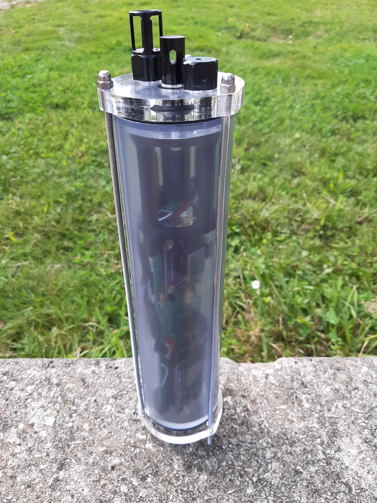

# Module 2 : Caisson CTD

## Compétences requises

* Découpeuse laser
* Imprimante 3D&#x20;
* Affleureuse
* Taraudage

Le capteur&#x20;

<figure><figcaption>
à savoir que la sonde est étanche uniquement lorsque les capteurs bouches les trous des bouchons A et B (cf. plus bas)
</figcaption></figure>

Liste du matériel

\
**Boitiers :**

* Tube PVC
* PCB ([voir si dessous pour le plan](module-1-carte-electronique-pcb.md))
* 3 tige filetée 3mm, L 25cm
* écrous x3&#x20;
* écrous papillons x3
* Vis M3x10
* disque PMMA 10mm (pour les bouchons)
* Presse étoupe PG16, IP68 - [Fournisseur](https://fr.rs-online.com/web/p/presse-etoupes/8229681/?relevancy-data=7365617263685F636173636164655F6F726465723D31267365617263685F696E746572666163655F6E616D653D4931384E525353746F636B4E756D626572267365617263685F6C616E67756167655F757365643D656E267365617263685F6D617463685F6D6F64653D6D61746368616C6C267365617263685F7061747465726E5F6D6174636865643D5E2828282872737C5253295B205D3F293F285C647B337D5B5C2D5C735D3F5C647B332C347D5B705061415D3F29297C283235285C647B387D7C5C647B317D5C2D5C647B377D29292924267365617263685F7061747465726E5F6F726465723D31267365617263685F73745F6E6F726D616C697365643D59267365617263685F726573706F6E73655F616374696F6E3D267365617263685F747970653D52535F53544F434B5F4E554D424552267365617263685F77696C645F63617264696E675F6D6F64653D4E4F4E45267365617263685F6B6579776F72643D3832322D39363831267365617263685F6B6579776F72645F6170703D38323239363831267365617263685F636F6E6669673D3126\&searchHistory=%7B%22enabled%22%3Atrue%7D)
* Joints (à préciser)  x2
* Joints 2mm épaisseurs - diamètres trou

\
**Outils et accessoires d'atelier :**

* Outils de base (tournevis, pince plate, pince coupante, clef anglaise, clef plates...)
* Règle/mètre/crayon/Cutter/Ciseaux
* accès à découpeuse laser et imprimante 3D

#### Construction

La construction se divise en 3 modules :

> **Module bouchons :** découpe laser des bouchons dans du plexigalss 10mm et taraudage des trous de vis
>
> **Module découpe du caisson** : découpe du caisson en PVC, chanfreinage et des tiges filetées&#x20;
>
> **Module impression 3D** : impression des pièces 3D puis assemblage

Les modules sont réalisables séparément et simultanément.

->&#x20;

Ces pages décrivent le boîtier étanche (prévu) du CTD LowCost. Notez que BlueRobotics propose de bons boîtiers étanches, voir par exemple (https://bluerobotics.com/store/watertight-enclosures/wtevp/# tube) , mais le prix est assez élevé. Nous avons conçu un boîtier rapide et facile à construire qui ne nécessite que peu d'outils à l'exception d'un lasercut et d'une imprimante 3D (que l'on peut trouver dans la plupart des Fablabs voir : https://www.fablabs.io/labs/map).

-> Le corps de l'enceinte est constitué d'un tube PVC standard (européen) à pression (63mm, épaisseur 4.7). Chaque capuchon est constitué de 2 « disques » de PMMA (plexiglas) d'une épaisseur de 10mm comme illustré ci-dessous. Les deux disques des capuchons des capteurs sont maintenus ensemble avec les capteurs BAR30 et FastTemps, un filetage M10 a été réalisé dans le disque PMMA intérieur. Les capteurs de conductivité passent par des trous et l'étanchéité est assurée par un joint torique de 2mm placé dans une rainure triangulaire qui a été réalisée à l'aide d'une fraise à bois. Les dimensions de la rainure ont été ajustées « à l'œil nu » pour permettre au joint torique d'être bien pressé. La situation est plus simple pour le bouchon opposé, où les deux disques de PMMA sont maintenus ensemble par des vis M3, vissées dans des trous borgnes M3 du disque de PMMA extérieur (voir illustration ci-dessous).

-> L'étanchéité entre les bouchons et le tube en PVC est obtenue en pressant un joint torique de 4 mm dans une rainure triangulaire (réalisée à l'aide d'une fraise à bois). Les dimensions de la rainure ont été ajustées « à l'œil nu » pour permettre un bon enfoncement du joint torique. La pression est obtenue en utilisant trois tiges filetées externes qui permettent une bonne réparation de la pression (elle ne fonctionne pas bien avec seulement deux tiges filetées).

Traduit avec DeepL.com (version gratuite)

\_\_\_\_\_\_\_\_\_\_\_\_\_\_\_\_\_\_\_\_\_\_\_\_\_\_\_\_\_\_\_\_\_\_\_\_\_\_\_\_\_\_\_\_\_\_\_\_\_\_\_\_\_\_\_\_\_\_\_\_\_\_\_\_\_\_\_\_\_\_\_\_\_\_\_\_\_\_\_\_\_\_\_\_\_\_\_\_\_\_\_\_

\
Caisson conçu pour les sondes CTD.

\
&#xNAN;**## Image du matériel**

 (1).JPG>)

\
&#xNAN;**## Vue d'ensemble du caisson**

.png>)

 (1).png>)

\
&#xNAN;**## Impression des supports PCB à l'imprimante 3D**

\
Imprimer les supports PCB à l'imprimante 3D.\
Fichiers imprimante 3D pour support PCB

Ci-joint, les fichiers en ".stl" à imprimer

[support-PCB1\_V3 v4.stl](https://prod-files-secure.s3.us-west-2.amazonaws.com/1acf120e-63a9-4ded-8ae1-b4d03af0a47f/bf4da90d-6242-4c01-8fd3-bfe7b6497f50/support-PCB1_V3_v4.stl)  -  4h12, 28g @ 50% infill, PLA

[bride\_inférieure\_PCB v6.stl](https://prod-files-secure.s3.us-west-2.amazonaws.com/1acf120e-63a9-4ded-8ae1-b4d03af0a47f/7cb4b184-c573-4783-a7d2-35a51a286fe7/bride_infrieure_PCB_v6.stl)  -  48 min, 5g @ 50% infill, PLA\

**## Réalisation des bouchons à la découpeuse laser**\

Découper le PMMA 10 mm à la découpeuse laser.\
Fichiers découpeuse laser pour bouchons

\
&#xNAN;_<mark style="color:orange;">Réglages de la découpeuse laser Trotec</mark>_\
_<mark style="color:orange;">\* pour la gravure :</mark>_\
_<mark style="color:orange;">Matériau : PMMA / Puissance : 90 / Vitesse : 28/ Fréquence : 1000PPI</mark>_\
_<mark style="color:orange;">\* pour la découpe :</mark>_\
_<mark style="color:orange;">Matériau : PMMA 10mm / Puissance : 100 / Vitesse : 0.10 / Fréquence : 8000Hz</mark>_

\
Sur les dessins, il y a des croix bleues, ce sont des cibles pour les perçages non-traversants des bouchons. À la découpeuse laser il faut donc graver et non couper. Les cibles bleues correspondent à la position de deux perçages non-traversants qu'il faut percer à 2,5 mm puis tarauder en M3, c'est la seule partie délicate de la réalisation des bouchons.

Bouchons  :\

<figure><figcaption>
Bouchon A
</figcaption></figure>

Chanfreiner l’ouverture centrale du bouchon A à 7,5 mm de profondeur avec la\
perceuse à colonne (équipée d’une fraise à chanfreiner de 15 mm de diamètre). Ne pas chanfreiner plus profond que 1mm. Le joint qui s'y glissera fait 2mm de diamètre.

<figure><figcaption>
Bouchon B
</figcaption></figure>

Tarauder les pas de vis du bouchon B en M3.

<figure><figcaption>
Bouchon C
</figcaption></figure>

Les cibles sur le bouchon C correspondent à la position de deux perçages non-\
traversants. Percer les cibles à 5 mm de profondeur avec la perceuse à colonne\
(équipée d'un foret à acier de 2,5 mm de diamètre). Tarauder ensuite les trous en M3.

<figure><figcaption>
Bouchon D
</figcaption></figure>

\

<figure><figcaption>
Perceuse à colonne à utiliser pour percer les bouchons B et C avec un forêt 2,5mm et chanfreiner le bouchon A.
</figcaption></figure>

\_\_\_\_\_\_\_\_\_\_\_\_\_\_\_\_\_\_\_\_\_\_\_\_\_\_\_\_\_\_\_\_\_\_\_\_\_\_\_\_\_\_\_\_\_\_\_\_\_\_\_\_\_\_\_\_\_\_\_\_\_\_\_\_\_\_\_\_\_\_\_\_\_\_\_\_\_\_\_\_\_\_\_\_\_\_\_\_\_\_\_\_

**## Découpe du tube PVC et de la barre filetée**

\
Découper un cylindre de 24,5 cm de longueur dans le tube PVC avec la scie\
circulaire. Chanfreiner les bords du tube avec l'affleureuse (angle de 45°).

Il faut également usiner les chanfreins sur les bords du tube, avec une défonceuse (ou affleureuse) montée a l'envers sur une petite table avec une fraise à roulement à 45°. Il faut régler la profondeur d'usinage (sortie de la fraise par rapport à la table) de telle sorte à faire un logement suffisant pour le joint.

(AJOUTER PHOTO D'UN TUBE DE PVC)&#x20;

(AJOUTER PHOTO UTILISATION AFFLEUREUSE)

\
Fixer la tige filetée dans l'étau, avec des cales en bois pour la protéger.\
Découper trois tige de 28,5 cm de longueur avec la scie sauteuse (équipée d'un\
foret à métaux).&#x20;

Limer les extrémités avec une lime à métaux pour faciliter l’insertion des écrous papillons.

\
.jpg>)

<figure><figcaption></figcaption></figure>

**## Assemblage**\
